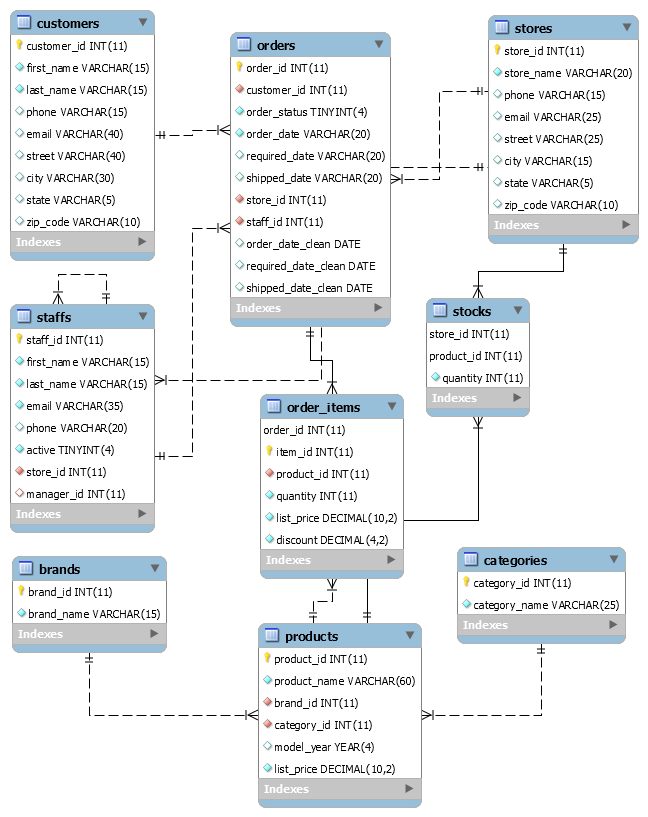
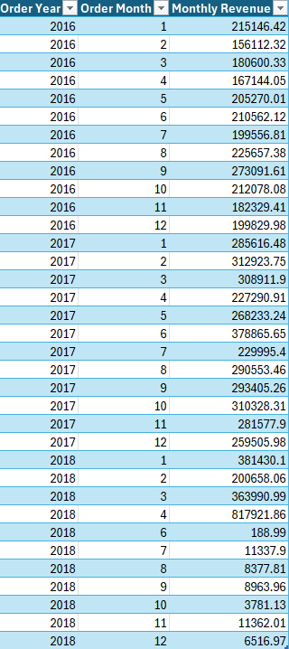
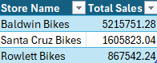
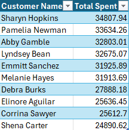
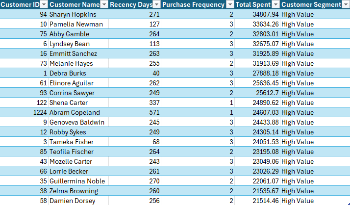

# Bike Store Sales & Operations Analysis (MySQL)

## Project Overview

This project analyzes retail sales and operations data for a multi-store bike retailer using **MySQL**. The goal is to transform raw transactional data into business insights related to **sales performance, customer behavior, fulfillment efficiency, and inventory risk**.

The project demonstrates SQL skills commonly used in analytics and data science workflows, including **relational database design, data cleaning, and business-focused SQL analysis**.

---

## Business Problem

Retail management needs better visibility into operational performance and customer behavior. Key business questions include:

- Which stores generate the most revenue?
- Which products and categories drive the most sales?
- Who are the highest-value customers?
- Are there delays in order fulfillment?
- Which products are at risk of stocking out?

Answering these questions helps improve **inventory planning, marketing strategy, and operational efficiency**.

---

## Database Schema

The relational structure of the bike store database is shown below.



The schema includes transactional tables for **orders and order items**, dimension tables for **customers, products, brands, categories, and stores**, and operational tables for **staff and inventory management**.

---

## Project Workflow

### 1. Database Design

A relational database schema was created in MySQL including tables for:

- customers  
- orders  
- order_items  
- products  
- categories  
- brands  
- stores  
- inventory (stocks)

Foreign keys were used to maintain **referential integrity** between tables.

---

### 2. Data Cleaning & Validation

Data quality checks were performed to identify:

- missing values  
- invalid quantities  
- invalid discount values  
- inconsistent date formats  

Date fields imported from CSV files were converted to proper **DATE format using `STR_TO_DATE()`**.

---

### 3. SQL Analysis

Business analysis queries were written using:

- **joins**
- **aggregations**
- **CTEs (Common Table Expressions)**
- **window functions**
- **ranking functions**

These queries answer key stakeholder questions related to sales, customer value, operations, and inventory risk.

---

## Key Analyses

The project explores several business analytics areas:

- Revenue performance by **store, brand, and product category**
- **Monthly sales trends**
- **Top customers by total spending**
- **Customer purchasing behavior**
- **Customer segmentation**
- **Order fulfillment performance**
- **Inventory risk and stockout detection**

---

## Example Insights

### Monthly Revenue Trend



### Store Revenue Ranking



### Top Customers by Spending



### Customer Segmentation



---

## Tools Used

- **MySQL**
- **MySQL Workbench**
- **SQL**
  - joins
  - aggregations
  - CTEs
  - window functions
- **CSV data files**

---

## Project Structure

```
bike-store-sales-analysis-mysql
│
├── README.md
├── 01_schema.sql
├── 02_data_cleaning.sql
├── 03_analysis.sql
└── images
    ├── database_schema.png
    ├── monthly_revenue_chart.png
    ├── store_revenue.png
    ├── top_customers.png
    └── customer_segmentation.png
```

---

## Repository Files

| File | Description |
|-----|-------------|
| `01_schema.sql` | Database schema and table creation |
| `02_data_cleaning.sql` | Data validation and cleaning queries |
| `03_analysis.sql` | Business analysis queries |

---

## Data Source

The dataset used in this project comes from Kaggle:

Bike Store Sample Database  
https://www.kaggle.com/datasets/dillonmyrick/bike-store-sample-database

This dataset contains transactional retail data including customers, orders, products, stores, and inventory.

---

## Skills Demonstrated

- SQL data analysis  
- relational database design  
- data cleaning and validation  
- business analytics  
- customer segmentation  
- operational analytics  

---

## Author

This project is part of a **data science portfolio demonstrating SQL and business analytics skills**.
